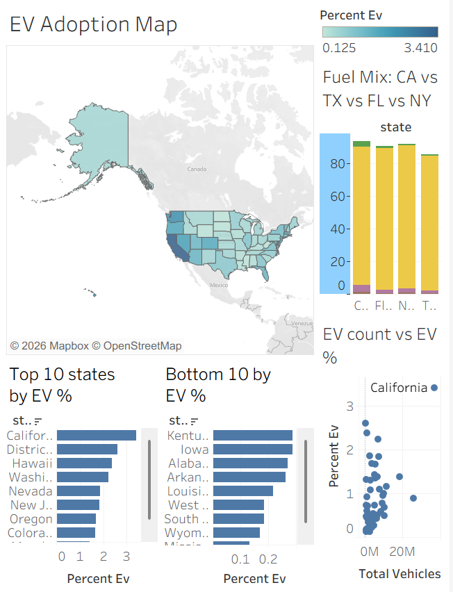
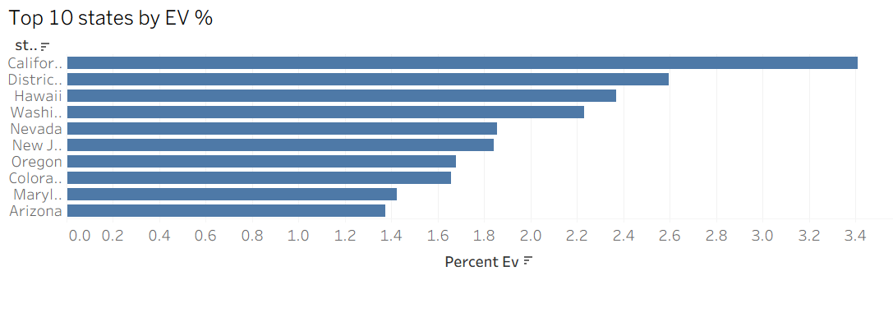
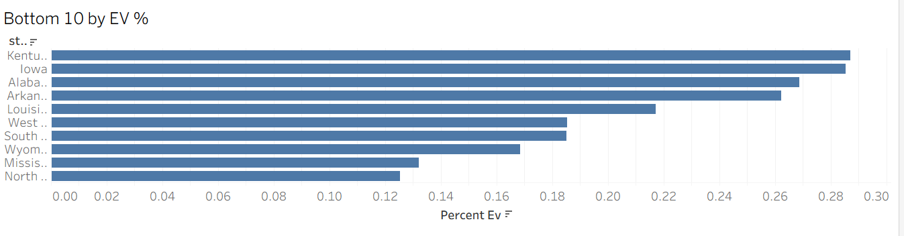
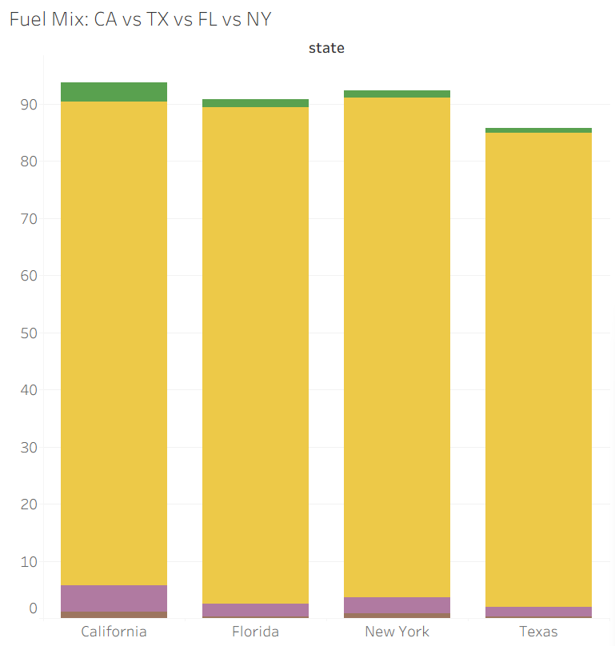
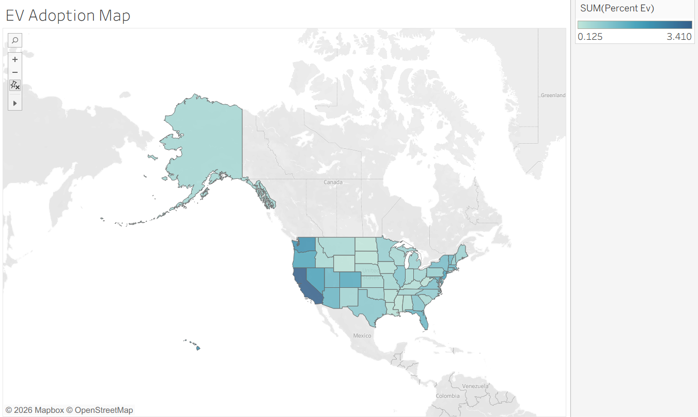
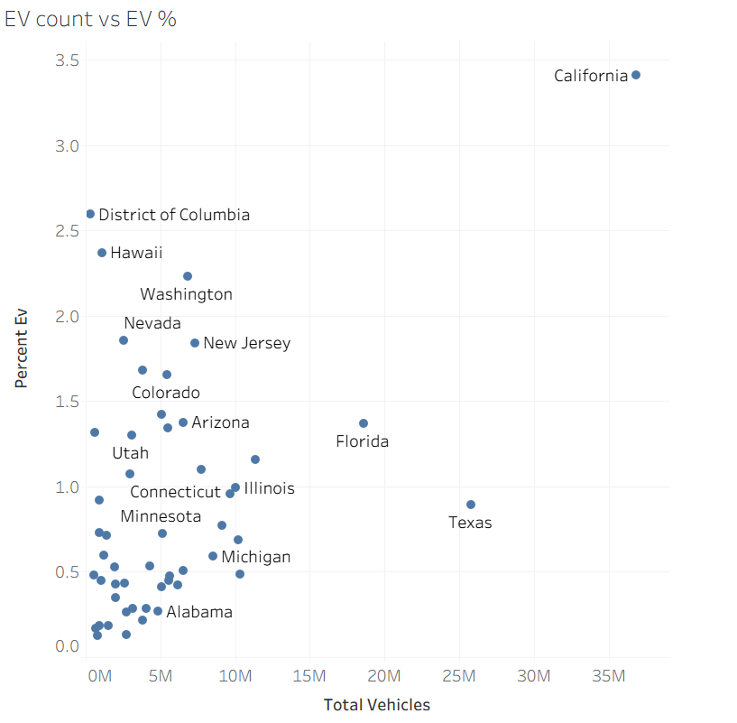

# U.S. Alternative Fuel Vehicle Adoption — State-Level Analysis

A data-driven analysis of alternative fuel vehicle (EV, PHEV, HEV, biodiesel, ethanol, hydrogen) registration share across all 50 U.S. states + DC, built to inform charging infrastructure planning and EV adoption forecasting.

**Tech stack:** MySQL Workbench (data cleaning + analysis) → Tableau Public (visualization + dashboard)

**Live dashboard:** https://public.tableau.com/views/EVmarketshare/EVMarketShareInfrastructurePriorityDashboard?:language=en-US&publish=yes&:sid=&:redirect=auth&:display_count=n&:origin=viz_share_link

---

## 1. Project Overview

This project analyzes state-level vehicle registration data across 12 fuel categories to answer four questions for a government transportation planning board:

1. What percentage of vehicles in each state are EVs, PHEVs, HEVs, and gasoline?
2. Which states lead and lag in EV adoption?
3. Which alternative fuels (biodiesel, ethanol, hydrogen) are significant vs. niche nationally?
4. Where should EV infrastructure investment be prioritized?

---

## 2. Data Source

State-level vehicle registration counts across 12 fuel types: Electric (EV), Plug-In Hybrid (PHEV), Hybrid (HEV), Biodiesel, Ethanol/Flex (E85), CNG, Propane, Hydrogen, Methanol, Gasoline, Diesel, and Unknown Fuel.

- 51 rows (50 states + District of Columbia)
- Values reported to the nearest 100 vehicles by the source

---

## 3. Data Cleaning

- Source had 51 rows (50 states + DC) — no rows dropped
- No missing/null values found in any column (verified via `COUNT(*) - COUNT(col) = 0` check across all fields)
- Numbers were stored as text with comma separators (e.g. `"4,102,200"`) — converted to numeric using `REPLACE(col, ',', '')` + `CAST(... AS UNSIGNED)`
- `Methanol` column dropped — zero registrations reported nationwide
- Zero values in CNG, Propane, and Hydrogen columns were **retained as valid data**, not treated as errors. The source rounds to the nearest 100, so a `0` indicates a count below ~50 vehicles rather than confirmed zero.
- Renamed raw import table and columns to snake_case; built a clean numeric table (`vehicle_clean`) from the raw text table (`vehicle_data`)
- **Sanity check:** total vehicles per state (all 11 fuel columns summed) matched expected real-world registration scale — California (36.85M), Texas (25.80M), Florida (18.58M), New York (11.32M), Ohio (10.32M) — confirming the cleaned data is usable for analysis

---

## 4. Market Share Analysis

### EV / PHEV / HEV / Gasoline share by state
Calculated as each fuel type's count divided by total registered vehicles per state (all 11 fuel columns, Methanol excluded), expressed as a percentage.

### Top 5 states by EV adoption rate (EV % of total vehicles)

| Rank | State | EV % |
|---|---|---|
| 1 | California | 3.41% |
| 2 | District of Columbia* | ~2.6% |
| 3 | Hawaii | ~2.4% |
| 4 | Washington | ~2.2% |
| 5 | Nevada | ~1.85% |

*DC is a federal district, not a state — included for completeness but noted separately since its dense urban profile isn't comparable to state-level infrastructure planning.

### Bottom 5 states by EV adoption rate

| Rank | State | EV % |
|---|---|---|
| 47 | West Virginia | ~0.18% |
| 48 | South Dakota | ~0.18% |
| 49 | Wyoming | ~0.17% |
| 50 | Mississippi | ~0.13% |
| 51 | North Dakota | ~0.12% |

The gap between the highest and lowest state is roughly **28x** (California 3.41% vs. North Dakota 0.12%), indicating extremely uneven EV adoption nationally.

### California vs. other large states (by fleet size)

| State | Total Vehicles | EV % |
|---|---|---|
| California | 36.85M | 3.41% (highest in the country) |
| Texas | 25.80M | ~0.9% |
| Florida | 18.58M | ~1.4% |
| New York | 11.32M | ~1.1% |

California leads by a wide margin on both fleet size and adoption rate. Texas, despite having the second-largest vehicle fleet in the country, has one of the lowest EV adoption rates among large states — a significant gap given its scale.

---

## 5. Trend & Insights

### Alternative fuel significance: national averages

| Fuel | Avg. % of state fleet | States above 0.5% threshold | Verdict |
|---|---|---|---|
| Ethanol/Flex (E85) | 7.60% | 51 / 51 | **Significant** — present meaningfully in every state |
| Biodiesel | 1.17% | 44 / 51 | **Significant, moderate scale** — broad but smaller presence |
| Hydrogen | 0.0009% | 0 / 51 | **Niche** — effectively absent nationwide |

Ethanol/Flex vehicles are the most widespread alternative fuel type, averaging 7.6% of vehicles across all 50 states and DC — every state exceeds the 0.5% threshold. Biodiesel shows moderate, broad presence (1.17% average, 44/51 states above threshold). Hydrogen is functionally niche nationwide — even in California, the only state with meaningful hydrogen vehicle counts, it remains under 0.1% of that state's total fleet. This suggests hydrogen infrastructure investment should stay geographically concentrated (California) rather than distributed, while ethanol infrastructure is already justified nationwide.

### Key visual findings

- **Map:** EV adoption is heavily concentrated on the West Coast and in a handful of small, high-income states (Hawaii, DC-adjacent areas); the central and southern U.S. shows consistently low adoption.
- **Fuel mix (CA/TX/FL/NY):** Gasoline still accounts for roughly 85–90% of registered vehicles in all four states, including California — EVs, PHEVs, and HEVs combined remain a small minority even in the most EV-forward large state.
- **Scatter plot (EV count vs. EV %):** This is the clearest infrastructure-planning signal in the analysis. States cluster into four groups:
  - **High fleet size + high EV %:** California (leading on both dimensions)
  - **High fleet size + low EV %:** Texas, Florida — large, underserved markets
  - **Low fleet size + high EV %:** Hawaii, Washington, DC, Nevada — already progressing despite smaller scale
  - **Low fleet size + low EV %:** most remaining states, particularly the Midwest/South

---

## 6. Recommendations

Based on the data, we recommend prioritizing EV infrastructure investment in the following three states:

### 1. Texas
- Second-largest vehicle fleet in the country (25.80M total vehicles) but EV adoption sits around 0.9% — well below the national leaders and behind Florida and New York despite a larger fleet.
- A 1-percentage-point improvement in Texas EV adoption represents a far larger absolute number of vehicles converted than the same improvement in a small state, making it a high-leverage target for infrastructure spending.

### 2. Florida
- Third-largest fleet (18.58M vehicles) with EV adoption around 1.4% — better than Texas, but still low relative to fleet size.
- Growing population and vehicle base means unmet charging demand will compound over time without early investment.

### 3. New York
- Fourth-largest fleet (11.32M vehicles), EV adoption around 1.1%, trailing California, Hawaii, and Washington despite strong state-level EV policy support.
- Dense urban centers (NYC metro) make charging infrastructure gaps especially visible and costly to residents without home charging access — a strong case for targeted urban charging investment.

**Why not the current leaders (California, Hawaii, DC)?** These states already show high adoption relative to fleet size, indicating existing infrastructure and policy support are functioning. The larger opportunity — measured in absolute vehicles affected — lies in closing the gap in large, currently underserved states rather than reinforcing states that are already ahead.

---
